# Paper Identification

|  |   |
| ---  |  -------|
| ID  |   |
| Author  |   |
| Title  |   |
| Iteration |   |


# Summary

In assessing compliance with our [Data and Code Availability Policy](https://www.journals.uchicago.edu/journals/jpe/datapolicy), our reproducibility team has identified the following issues, which we ask you to address:

1. Please add correct data citations in both readme and paper. We have specific [guidance here](https://social-science-data-editors.github.io/guidance/Guidance/Data_citation_guide.html). In the paper, please add one citation per data set (not one citation per vintage).
2. We found a few discrepancies and we are unsure whether those arise from not having access to the HWOL data or not. From your code it seems you intended to give us temporary access to those data (this would be much preferred); we did not find any confidential data in the package. Please provide a table in the readme which explicitly lists all exhibits which can and which can not be reproduced without access to the confidential data. 
3. The code mistakes we found are minor, but maybe easy to fix.
4. Please provide info about any random seeds that need to be set.
5. Regarding access to the confidential data, please describe in detail all the necessary steps in order to obtain the data - this is true even though you might consider such data as fairly standard in your field.
6. I need a dedicated Data Availability and Provenance Statement in your readme.
7. Please include both statements about rights below.

# General

- [ ] Data Availability and Provenance Statements
  - [ ] Statement about Rights - Part 1: Right to use the data (e.g. *did the authors lawfully obtain the data*)
  - [ ] Statement about Rights - Part 2: Right to publish the data (e.g. *are human subjects involved and did permission been granted to publish their data?*)
  - [ ] License for Data (optional, but recommended)
  - [x] Details on each Data Source
- [x] Dataset list
- [x] Computational requirements
  - [x] Software Requirements
  - [ ] Controlled Randomness (as necessary)
  - [x] Memory, Runtime, and Storage Requirements
- [x] Description of programs/code
  - [ ] License for Code (Optional, but recommended) 
- [ ] List of tables and programs
- [ ] References (Optional, but recommended) 


# High-level Description of Research Project

*This research project...*

- [x] uses observational data.
- [x] uses *confidential* observational data.
- [ ] uses data generated via experiment or trial by the authors (in field or lab).
  - [ ] For lab experiments: The code to implement the experimental protocol (z-Tree, o-Tree etc) is included in the package.
  - [ ] A PDF copy of IRB approval is contained in the package.
  - [ ] A PDF document outlining the design of the experiment, including information on the selection and eligibility of participants is included.
  - [ ] A PDF copy of the instructions given to participants in both original language and an English translation is included.
- [ ] uses data generated via survey by the authors (in field or online)
  - [ ] The programs used to administer the survey (e.g. qualtrics survey file) are included.
  - [ ] A PDF copy of IRB approval is contained in the package.
  - [ ] A PDF of the original questionaire(s) and information on the selection and eligibility of participants is included.
- [ ] is a simulation study: the data are generated by an algorithm.
- [ ] is a numerical illustration: no data are used but code is used to produce illustrative output (tables, figures)


# Data description

For any data that cannot be provided as part of the replication package, please provide the following information as part of the README.

> {REQUIRED}  Please specify how long the data will be preserved in the restricted-access location.

> {REQUIRED} Please provide affirmation of support for replication checks.
  - As per the [JPE policy](https://jpedataeditor.github.io/policy.html), "In cases where data cannot be published in an openly accessible trusted data repository like the JPE dataverse, authors who have requested an exemption to publish them at the time of first submission must commit to preserving the data and code for a period of no less than five years following the publication of the paper. They should also provide reasonable assistance to requests for clarification and replication."


> {REQUIRED} Please provide a codebook for the data.
  - The codebook should at a minimum describe the variables obtained from the data source, in a manner that will let others verify that they have obtained a substantially similar dataset if successfully obtaining access to the data.


## Data Sources

| file/name | public | private | DOI/URL | Access described | cited readme | cited paper |
| ---- | --- | --- | --- | --- | --- | --- |
| BLS LAUS | yes | no | yes | yes | no | no |
| BLS JOLTS | yes | no | yes | yes | no | no |
| BLS QCEW | yes | no | yes | yes | no | no |
| Census LEHD QWI | yes | no | yes | yes | no | no |
| Census LODES | yes | no | yes | yes | no | no |
| BEA state GDP | yes | no | yes | yes | no | no |
| BEA CA25N industry employment | yes | no | yes | yes | no | no |
| FHFA HPI | yes | no | yes | yes | no | no |
| IRS SOI county income (via replication archive) | yes | no | yes | yes | no | no |
| NY Fed / Equifax county debt-to-income | yes | no | yes | yes | no | no |
| Saiz (2010) housing supply elasticity and WRLURI | yes | no | yes | yes | no | no |
| Census state tax revenue | yes | no | yes | yes | no | no |
| State business-policy indices | yes | no | yes | yes | no | no |
| USDA SNAP policy database | yes | no | yes | yes | no | no |
| Recovery.gov ARRA awards + geocorr crosswalk | yes | no | yes | yes | no | no |
| Census population estimates | yes | no | yes | yes | no | no |
| Shimer CPS separation series | yes | no | yes | yes | no | no |
| DOL / state UI benefit policy triggers | yes | no | yes | yes | no | no |
| County UI claims + UI tax receipts | yes | no | yes | yes | no | no |
| Census geography | yes | no | yes | yes | no | no |
| Conference Board HWOL vacancies (proprietary; synthetic stand-in provided) | no | yes | yes | yes | no | no |

Note: These are not formal data citations; the data citations should look like paper citations and be present in references in a consistent format. Please correct them, include year of the dataset and the access date. Add (permanent) urls.


# Requirements 

- [x] README is in TXT, MD, or PDF format
- [x] README is accessible at the root of the package (not inside a folder)
- [ ] Title conforms to guidance (starts with "Data and Code for: Title of Paper" or "Code for: Title of Paper", is properly capitalized)
- [x] Authors (with affiliations) are listed in the same order as on the paper

> {REQUIRED} Please review the title of the deposit as per our guidelines.


## Stated Requirements

- [ ] No requirements specified
- [x] Software Requirements specified as follows:
  - **Stata/MP** (the build and the `egen`-heavy steps assume MP). All required user-written
  commands install **automatically from SSC**: `code/config.do` — which every pipeline
  script sources — checks for and installs `regife` (interactive fixed effects, the
  Stata-side IFE cross-checks), `reghdfe`, `ivreg2` (+ its dependency `ranktest`),
  `outreg2`, `binscatter`, `ftools`, `coefplot`, `tuples`, `hdfe`, and `mat2txt` on first
  run (an internet connection is needed once). No packages are bundled in the archive;
  in particular `regife` is **not** redistributed — it loads from SSC like the rest.
  - **MATLAB** (developed on R2025b; the factor model and bootstrap reproduce across MATLAB
    versions) for the factor model, block bootstrap, and the structural model.
  - **Python 3** for `code/tex/make_tables.py` (standard library only) and a TeX distribution to
    compile the paper.
- [x] Computational Requirements specified as follows:
  - Peak disk while running: the built `data/processed/` master datasets are ~5 GB; the shipped archive itself (raw + provided inputs + code, no built files) is smaller.
- [x] Time Requirements specified as follows:
  - The Stata build (`data/processed` from `data/raw`) runs in a few minutes on a multi-core machine.
  - The factor-model **block bootstrap** (≈200 reps over ~1,100 county pairs) is the expensive step —
  **hours** per specification, and there are ~30 of them; the full `do_rep.sh` run is on the order of 10–15 hours on a multi-core machine. The bootstrap result CSVs are written to `output/factor_results/` as the run proceeds (the archive ships no pre-computed outputs).

- [ ] Requirements are complete.

For missing requirements, see the list of required changes in @sec-findings


# Analyzing Data and Code Files












## Code description




- [x] The replication package contains a "main" or "master" file(s) which calls all other auxiliary programs.

### Summary of output-producing code
The package contains a master code in [replication-package/JPEReplicationKitFinal/code/RunBuild.do](replication-package/JPEReplicationKitFinal/code/RunBuild.do#L37-L120) that runs the raw-data build steps and the processed-data construction stages. The paper tables are assembled by [replication-package/JPEReplicationKitFinal/code/tex/make_tables.py](replication-package/JPEReplicationKitFinal/code/tex/make_tables.py#L384-L1138), which reads CSV outputs generated by the Stata and Matlab analysis scripts and writes .tex fragments into the output/tables directory. The main figures are produced directly by [replication-package/JPEReplicationKitFinal/code/analysis/Binscatter_Figures.do](replication-package/JPEReplicationKitFinal/code/analysis/Binscatter_Figures.do#L60-L96), [replication-package/JPEReplicationKitFinal/code/analysis/MO_Tightness_Figures.do](replication-package/JPEReplicationKitFinal/code/analysis/MO_Tightness_Figures.do#L70-L120), [replication-package/JPEReplicationKitFinal/code/analysis/Make_CountyMap.py](replication-package/JPEReplicationKitFinal/code/analysis/Make_CountyMap.py#L3-L55), and [replication-package/JPEReplicationKitFinal/code/analysis/Make_BenefitMaps.py](replication-package/JPEReplicationKitFinal/code/analysis/Make_BenefitMaps.py#L3-L77). A small set of inline policy numbers is derived in [replication-package/JPEReplicationKitFinal/code/analysis/Derived_Policy_Calcs.do](replication-package/JPEReplicationKitFinal/code/analysis/Derived_Policy_Calcs.do#L1-L145).

### Data Preparation Code
| Program | Dataset or analysis file created | Reproduced? |
| --- | --- | --- |
| [replication-package/JPEReplicationKitFinal/code/RunBuild.do](replication-package/JPEReplicationKitFinal/code/RunBuild.do#L37-L120) | Main orchestrator for the full raw-data rebuild and the processed-data build. | Yes |
| [replication-package/JPEReplicationKitFinal/code/build/MakeDataSetsMainPaper_v5_newvac.do](replication-package/JPEReplicationKitFinal/code/build/MakeDataSetsMainPaper_v5_newvac.do#L1-L40) | Builds the main analysis panel used in the paper regressions. | Yes |
| [replication-package/JPEReplicationKitFinal/code/build/MakeDataControls.do](replication-package/JPEReplicationKitFinal/code/build/MakeDataControls.do#L1-L80) | Builds the control-variable panel used by the analysis scripts. | Yes |
| [replication-package/JPEReplicationKitFinal/code/analysis/Derived_Policy_Calcs.do](replication-package/JPEReplicationKitFinal/code/analysis/Derived_Policy_Calcs.do#L1-L145) | Writes the derived policy-scenario CSV that underlies the paper's inline policy numbers. | Yes |

### Tables and Figures
| Output in paper | Program and line number(s) | Reproduced? |
| --- | --- | --- |
| Table 1 / tab:Benefits_on_unemp | [replication-package/JPEReplicationKitFinal/code/tex/make_tables.py](replication-package/JPEReplicationKitFinal/code/tex/make_tables.py#L384-L484) | Yes |
| Table 2 / tab:Forward_Spec | [replication-package/JPEReplicationKitFinal/code/tex/make_tables.py](replication-package/JPEReplicationKitFinal/code/tex/make_tables.py#L661-L702) and [replication-package/JPEReplicationKitFinal/code/matlab/ProcessQDK.m](replication-package/JPEReplicationKitFinal/code/matlab/ProcessQDK.m#L107-L125) | Yes |
| Table 3 / tab:Benefits_on_JobCreation | [replication-package/JPEReplicationKitFinal/code/tex/make_tables.py](replication-package/JPEReplicationKitFinal/code/tex/make_tables.py#L997-L1030) | Yes |
| Table 4 / tab:Benefits_on_Wages | [replication-package/JPEReplicationKitFinal/code/tex/make_tables.py](replication-package/JPEReplicationKitFinal/code/tex/make_tables.py#L737-L827) | Yes |
| Figure 1(a) and Figure 1(b) / fig:binscatter_du and fig:binscatter_qdu | [replication-package/JPEReplicationKitFinal/code/analysis/Binscatter_Figures.do](replication-package/JPEReplicationKitFinal/code/analysis/Binscatter_Figures.do#L60-L96) | Yes |
| Figure A-1 / fig:MO_vacPuD | [replication-package/JPEReplicationKitFinal/code/analysis/MO_Tightness_Figures.do](replication-package/JPEReplicationKitFinal/code/analysis/MO_Tightness_Figures.do#L70-L120) | Yes |
| Figure A-2 / fig:Tightness_MO_Borders | [replication-package/JPEReplicationKitFinal/code/analysis/MO_Tightness_Figures.do](replication-package/JPEReplicationKitFinal/code/analysis/MO_Tightness_Figures.do#L70-L120) | Yes |
| Table A-1 / tab:MO_V_U | [replication-package/JPEReplicationKitFinal/code/tex/make_tables.py](replication-package/JPEReplicationKitFinal/code/tex/make_tables.py#L1070-L1099) and [replication-package/JPEReplicationKitFinal/code/analysis/MO_Tightness_Figures.do](replication-package/JPEReplicationKitFinal/code/analysis/MO_Tightness_Figures.do#L104-L120) | Yes |
| Figure A-3 / fig:initial-guess | [replication-package/JPEReplicationKitFinal/code/tex/make_tables.py](replication-package/JPEReplicationKitFinal/code/tex/make_tables.py#L1138-L1160) and [replication-package/JPEReplicationKitFinal/code/matlab/RunMonteCarlo.m](replication-package/JPEReplicationKitFinal/code/matlab/RunMonteCarlo.m#L1-L30) | No |
| Table A-2 / tab:Monte-Carlo-Results | [replication-package/JPEReplicationKitFinal/code/tex/make_tables.py](replication-package/JPEReplicationKitFinal/code/tex/make_tables.py#L1138-L1160) and [replication-package/JPEReplicationKitFinal/code/matlab/RunMonteCarlo.m](replication-package/JPEReplicationKitFinal/code/matlab/RunMonteCarlo.m#L1-L30) | Yes |
| Table A-3 / tab:Benefits_on_unemp_OLS | [replication-package/JPEReplicationKitFinal/code/tex/make_tables.py](replication-package/JPEReplicationKitFinal/code/tex/make_tables.py#L293-L381) | Yes |
| Table A-4 / tab:Endog_Vars | [replication-package/JPEReplicationKitFinal/code/tex/make_tables.py](replication-package/JPEReplicationKitFinal/code/tex/make_tables.py#L878-L919) and [replication-package/JPEReplicationKitFinal/code/analysis/Endog_Vars.do](replication-package/JPEReplicationKitFinal/code/analysis/Endog_Vars.do#L34-L84) | Yes |
| Figure A-4 / fig:endogeneity_test_unemp | [replication-package/JPEReplicationKitFinal/code/analysis/Derived_Policy_Calcs.do](replication-package/JPEReplicationKitFinal/code/analysis/Derived_Policy_Calcs.do#L1-L145) | No |
| Table A-7 / tab:Mobility_LODES | [replication-package/JPEReplicationKitFinal/code/tex/make_tables.py](replication-package/JPEReplicationKitFinal/code/tex/make_tables.py#L923-L952) and [replication-package/JPEReplicationKitFinal/code/analysis/Mobility_LODES.do](replication-package/JPEReplicationKitFinal/code/analysis/Mobility_LODES.do#L29-L172) | Yes |
| Table A-8 / tab:Imputed_Results | [replication-package/JPEReplicationKitFinal/code/tex/make_tables.py](replication-package/JPEReplicationKitFinal/code/tex/make_tables.py#L956-L993) and [replication-package/JPEReplicationKitFinal/code/analysis/Imputed_Results.do](replication-package/JPEReplicationKitFinal/code/analysis/Imputed_Results.do#L28-L166) | Yes |
| Table A-9 / app_tab:A-1 | [replication-package/JPEReplicationKitFinal/code/tex/make_tables.py](replication-package/JPEReplicationKitFinal/code/tex/make_tables.py#L831-L876) and [replication-package/JPEReplicationKitFinal/code/analysis/TableA2.do](replication-package/JPEReplicationKitFinal/code/analysis/TableA2.do#L110-L168) | Yes |
| Table A-11 / tab:Benefits_on_unemp_beg | [replication-package/JPEReplicationKitFinal/code/tex/make_tables.py](replication-package/JPEReplicationKitFinal/code/tex/make_tables.py#L488-L605) | Yes |
| Table A-13 / tab:Benefits_on_unemp_SNAP_Mortgage | [replication-package/JPEReplicationKitFinal/code/tex/make_tables.py](replication-package/JPEReplicationKitFinal/code/tex/make_tables.py#L167-L197) | Yes |
| Table A-14 / tab:Benefits_on_unemp_stimulus_taxes | [replication-package/JPEReplicationKitFinal/code/tex/make_tables.py](replication-package/JPEReplicationKitFinal/code/tex/make_tables.py#L239-L290) | Yes |
| Table A-15 / tab:Benefits_on_unemp_other_policies | [replication-package/JPEReplicationKitFinal/code/tex/make_tables.py](replication-package/JPEReplicationKitFinal/code/tex/make_tables.py#L200-L236) | Yes |
| Figure A-5 / fig:Counties_Map | [replication-package/JPEReplicationKitFinal/code/analysis/Make_CountyMap.py](replication-package/JPEReplicationKitFinal/code/analysis/Make_CountyMap.py#L3-L55) | Yes |
| Figure A-6 and Figure 6(a-j) / fig:Benefit_Maps and fig:Benefit_Maps_42 through fig:Benefit_Maps_96 | [replication-package/JPEReplicationKitFinal/code/analysis/Make_BenefitMaps.py](replication-package/JPEReplicationKitFinal/code/analysis/Make_BenefitMaps.py#L3-L77) | Yes |
| Table A-16 / tab:app_Benefits_on_Wages | [replication-package/JPEReplicationKitFinal/code/tex/make_tables.py](replication-package/JPEReplicationKitFinal/code/tex/make_tables.py#L737-L827) | Yes |

### In-Text Numbers
| In-text numbers | Program | Line Number | Reproduced? |
| --- | --- | --- | --- |
| 16,000 | [replication-package/JPEReplicationKitFinal/code/analysis/Derived_Policy_Calcs.do](replication-package/JPEReplicationKitFinal/code/analysis/Derived_Policy_Calcs.do) | Not identified | Not yet verified |
| 93% | [replication-package/JPEReplicationKitFinal/code/analysis/Derived_Policy_Calcs.do](replication-package/JPEReplicationKitFinal/code/analysis/Derived_Policy_Calcs.do) | Not identified | Not yet verified |
| 5% | [replication-package/JPEReplicationKitFinal/code/analysis/Derived_Policy_Calcs.do](replication-package/JPEReplicationKitFinal/code/analysis/Derived_Policy_Calcs.do) | Not identified | Not yet verified |
| 2% | [replication-package/JPEReplicationKitFinal/code/analysis/Derived_Policy_Calcs.do](replication-package/JPEReplicationKitFinal/code/analysis/Derived_Policy_Calcs.do) | Not identified | Not yet verified |
| 1,172 | [replication-package/JPEReplicationKitFinal/code/analysis/Derived_Policy_Calcs.do](replication-package/JPEReplicationKitFinal/code/analysis/Derived_Policy_Calcs.do) | Not identified | Not yet verified |
| 1,132 | [replication-package/JPEReplicationKitFinal/code/analysis/Derived_Policy_Calcs.do](replication-package/JPEReplicationKitFinal/code/analysis/Derived_Policy_Calcs.do) | Not identified | Not yet verified |
| 14 | [replication-package/JPEReplicationKitFinal/code/analysis/Derived_Policy_Calcs.do](replication-package/JPEReplicationKitFinal/code/analysis/Derived_Policy_Calcs.do) | Not identified | Not yet verified |
| 0 to 18 | [replication-package/JPEReplicationKitFinal/code/analysis/Derived_Policy_Calcs.do](replication-package/JPEReplicationKitFinal/code/analysis/Derived_Policy_Calcs.do) | Not identified | Not yet verified |
| 1,113 | [replication-package/JPEReplicationKitFinal/code/analysis/Derived_Policy_Calcs.do](replication-package/JPEReplicationKitFinal/code/analysis/Derived_Policy_Calcs.do) | Not identified | Not yet verified |
| 59 | [replication-package/JPEReplicationKitFinal/code/analysis/Derived_Policy_Calcs.do](replication-package/JPEReplicationKitFinal/code/analysis/Derived_Policy_Calcs.do) | Not identified | Not yet verified |
| 282 / 9,024 | [replication-package/JPEReplicationKitFinal/code/analysis/Derived_Policy_Calcs.do](replication-package/JPEReplicationKitFinal/code/analysis/Derived_Policy_Calcs.do) | Not identified | Not yet verified |
| 26 to 99 | [replication-package/JPEReplicationKitFinal/code/analysis/Derived_Policy_Calcs.do](replication-package/JPEReplicationKitFinal/code/analysis/Derived_Policy_Calcs.do) | Not identified | Not yet verified |
| 13 or 20 | [replication-package/JPEReplicationKitFinal/code/analysis/Derived_Policy_Calcs.do](replication-package/JPEReplicationKitFinal/code/analysis/Derived_Policy_Calcs.do) | Not identified | Not yet verified |
| 4 | [replication-package/JPEReplicationKitFinal/code/analysis/Derived_Policy_Calcs.do](replication-package/JPEReplicationKitFinal/code/analysis/Derived_Policy_Calcs.do) | Not identified | Not yet verified |
| 10.7% | [replication-package/JPEReplicationKitFinal/code/analysis/Derived_Policy_Calcs.do](replication-package/JPEReplicationKitFinal/code/analysis/Derived_Policy_Calcs.do) | Not identified | Not yet verified |
| 16 | [replication-package/JPEReplicationKitFinal/code/analysis/Derived_Policy_Calcs.do](replication-package/JPEReplicationKitFinal/code/analysis/Derived_Policy_Calcs.do) | Not identified | Not yet verified |
| 13 | [replication-package/JPEReplicationKitFinal/code/analysis/Derived_Policy_Calcs.do](replication-package/JPEReplicationKitFinal/code/analysis/Derived_Policy_Calcs.do) | Not identified | Not yet verified |
| 3.02 and 2.15 | [replication-package/JPEReplicationKitFinal/code/analysis/Derived_Policy_Calcs.do](replication-package/JPEReplicationKitFinal/code/analysis/Derived_Policy_Calcs.do) | Not identified | Not yet verified |
| 5% to 9.6% | [replication-package/JPEReplicationKitFinal/code/analysis/Derived_Policy_Calcs.do](replication-package/JPEReplicationKitFinal/code/analysis/Derived_Policy_Calcs.do) | Not identified | Not yet verified |
| 95% to 90.4% | [replication-package/JPEReplicationKitFinal/code/analysis/Derived_Policy_Calcs.do](replication-package/JPEReplicationKitFinal/code/analysis/Derived_Policy_Calcs.do) | Not identified | Not yet verified |
| 10% | [replication-package/JPEReplicationKitFinal/code/analysis/Derived_Policy_Calcs.do](replication-package/JPEReplicationKitFinal/code/analysis/Derived_Policy_Calcs.do) | Not identified | Not yet verified |
| 0.4 to 0.5 | [replication-package/JPEReplicationKitFinal/code/analysis/Derived_Policy_Calcs.do](replication-package/JPEReplicationKitFinal/code/analysis/Derived_Policy_Calcs.do) | Not identified | Not yet verified |
| 0.0528 | [replication-package/JPEReplicationKitFinal/code/analysis/Derived_Policy_Calcs.do](replication-package/JPEReplicationKitFinal/code/analysis/Derived_Policy_Calcs.do) | Not identified | Not yet verified |
| 73 | [replication-package/JPEReplicationKitFinal/code/analysis/Derived_Policy_Calcs.do](replication-package/JPEReplicationKitFinal/code/analysis/Derived_Policy_Calcs.do) | Not identified | Not yet verified |
| 7.3 to 14.6 | [replication-package/JPEReplicationKitFinal/code/analysis/Derived_Policy_Calcs.do](replication-package/JPEReplicationKitFinal/code/analysis/Derived_Policy_Calcs.do) | Not identified | Not yet verified |
| 5/27 | [replication-package/JPEReplicationKitFinal/code/analysis/Derived_Policy_Calcs.do](replication-package/JPEReplicationKitFinal/code/analysis/Derived_Policy_Calcs.do) | Not identified | Not yet verified |
| 0.78% | [replication-package/JPEReplicationKitFinal/code/analysis/Derived_Policy_Calcs.do](replication-package/JPEReplicationKitFinal/code/analysis/Derived_Policy_Calcs.do) | Not identified | Not yet verified |
| 30 | [replication-package/JPEReplicationKitFinal/code/analysis/Derived_Policy_Calcs.do](replication-package/JPEReplicationKitFinal/code/analysis/Derived_Policy_Calcs.do) | Not identified | Not yet verified |
| 10,000 | [replication-package/JPEReplicationKitFinal/code/analysis/Derived_Policy_Calcs.do](replication-package/JPEReplicationKitFinal/code/analysis/Derived_Policy_Calcs.do) | Not identified | Not yet verified |

## Computing Environment of the Replicator
- Nuvolos v16, 64GB RAM
- Stata/MP 19.5
- Matlab R2024b
- Python 3.12.12
- pdfTeX 3.141592653-2.6-1.40.27

# Replication

The code and data were accessed via the provided replication package. Several modifications were required to execute the code successfully on the Nuvolos platform. 

## Fixes Applied


### Python Geopandas / Shapefile Error

The following error occurred during the map generation step because the expected shapefile directory was still compressed:

```
==== python maps ====
ERROR 1: PROJ: proj_create_from_database: Open of /usr/local/lib/conda/share/proj failed
Traceback (most recent call last):
  File "/files/JPE-Mitman-2016256/replication-package/JPEReplicationKitFinal/code/analysis/Make_BenefitMaps.py", line 47, in <module>
    gdf = gpd.read_file(SHP)
          ^^^^^^^^^^^^^^^^^^
  File "/usr/local/lib/conda/lib/python3.12/site-packages/geopandas/io/file.py", line 316, in _read_file
    return _read_file_pyogrio(
           ^^^^^^^^^^^^^^^^^^^
  File "/usr/local/lib/conda/lib/python3.12/site-packages/geopandas/io/file.py", line 576, in _read_file_pyogrio
    return pyogrio.read_dataframe(path_or_bytes, bbox=bbox, **kwargs)
           ^^^^^^^^^^^^^^^^^^^^^^^^^^^^^^^^^^^^^^^^^^^^^^^^^^^^^^^^^^
  File "/usr/local/lib/conda/lib/python3.12/site-packages/pyogrio/geopandas.py", line 382, in read_dataframe
    result = read_func(
             ^^^^^^^^^^
  File "/usr/local/lib/conda/lib/python3.12/site-packages/pyogrio/raw.py", line 200, in read
    return ogr_read(
           ^^^^^^^^^
  File "pyogrio/_io.pyx", line 1412, in pyogrio._io.ogr_read
  File "pyogrio/_io.pyx", line 262, in pyogrio._io.ogr_open
pyogrio.errors.DataSourceError: /files/JPE-Mitman-2016256/replication-package/JPEReplicationKitFinal/code/analysis/../../data/raw/cb_2025_us_county_20m/cb_2025_us_county_20m.shp: No such file or directory
FAILED: map figures
```

This was resolved by manually unzipping the archive in `data/raw`:

```
unzip cb_2025_us_county_20m.zip -d cb_2025_us_county_20m
```


### Python Directory Path Fix

In `make_tables.py` (line 1144), an incorrect directory reference caused an issue. The code was manually corrected from `HERE` to `IN_DIR`:

```
_mc = IN_DIR / "SenseResultsMonteCarlo.csv"
```

### PDFLaTeX Error

The script reported a compilation failure:

```
==== pdflatex ====
FAILED: paper compile
```

However, upon inspection, the PDF compiled successfully despite the terminal flag.


## Findings {#sec-findings}

### General Issues

- **Missing licensed data:** The README states that to reproduce the published vacancy numbers, the Data Editor replaces the synthetic files in `synthetic-data/` with the licensed HWOL data. These licensed files are not present in the package, meaning true reproduction of the vacancy numbers cannot be achieved as provided.
- **Controlled randomness:** No information is provided regarding controlled randomness (e.g., setting a seed) for any stochastic processes in the code.

## Missing Requirements

- [ ] Data Availability and Provenance Statements
  - [ ] Statement about Rights - Part 1: Right to use the data (e.g. *did the authors lawfully obtain the data*)
  - [ ] Statement about Rights - Part 2: Right to publish the data (e.g. *are human subjects involved and did permission been granted to publish their data?*)
  - [ ] License for Data (optional, but recommended)
- [ ] Computational requirements
  - [ ] Controlled Randomness (as necessary)
- [ ] List of tables and programs
- [ ] References (Optional, but recommended) 


## Data Preparation Code

After all modifications, programs ran without errors.

## Tables and Figures

### Figures

::: {#fig-1 layout-ncol="2"}
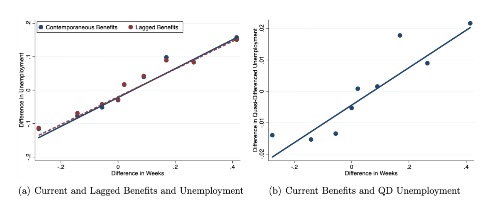{width=80%}

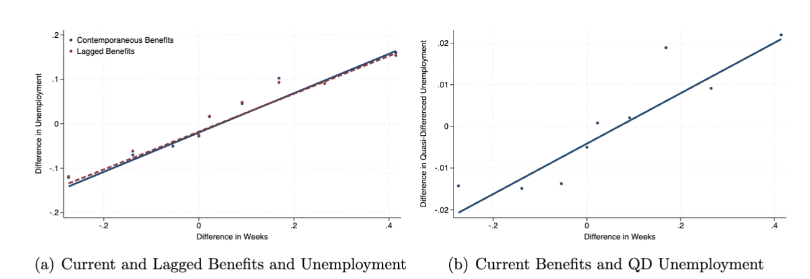{width=80%}

Figure 1
:::

**Finding:** Reproduced, but styling is noticeably different from the paper. Variations are present in the grid, the number of scales (horizontal vs. vertical), and the legend formatting.

::: {#fig-a1 layout-ncol="2"}
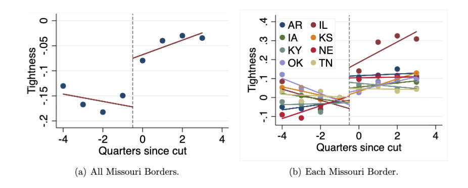{width=80%}

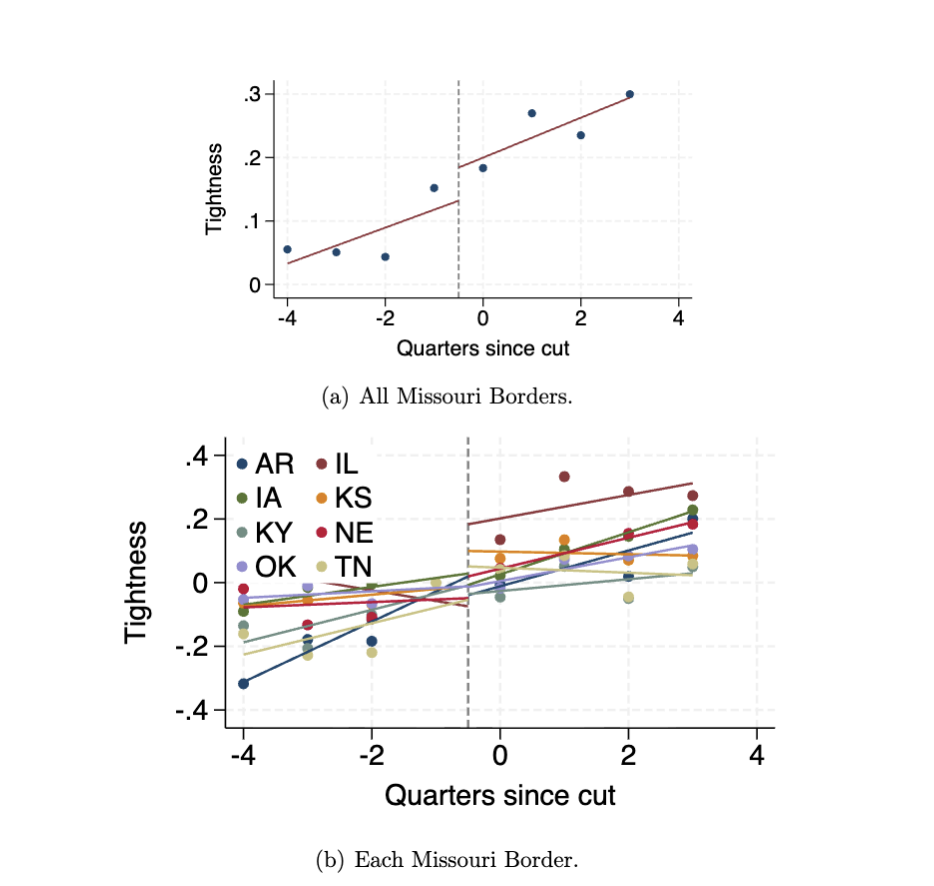{width=80%}

Figure A-1
:::

**Finding:** Results differ significantly from the paper. Visual styling is also entirely different.

**Figure A-3 (`initial_guess.pdf`)**

**Finding:** Not reproduced by the code.

::: {#fig-a5 layout-ncol="2"}
{width=80%}

{width=80%}

Figure A-5
:::

**Finding:** Reproduced, but features a completely different style and look compared to the published paper.

::: {#fig-a6 layout-ncol="2"}
{width=80%}

{width=80%}

Figure A-6
:::

**Finding:** Reproduced, but features a completely different style and look compared to the published paper.

**`StateUCrop.pdf`**

**Finding:** Not reproduced by the code.

### Tables

::: {#tbl-a1 layout-ncol="2"}
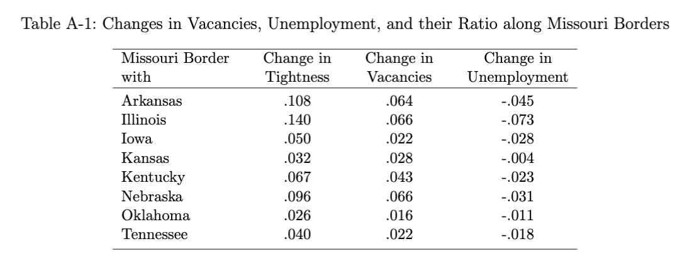{width=80%}

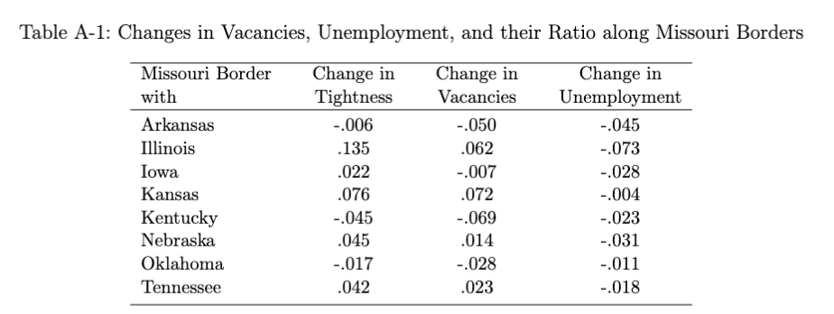{width=80%}

Table A-1
:::

**Finding:** The calculated change in vacancies and tightness differ from the reported numbers in the paper.

::: {#tbl-a16 layout-ncol="2"}
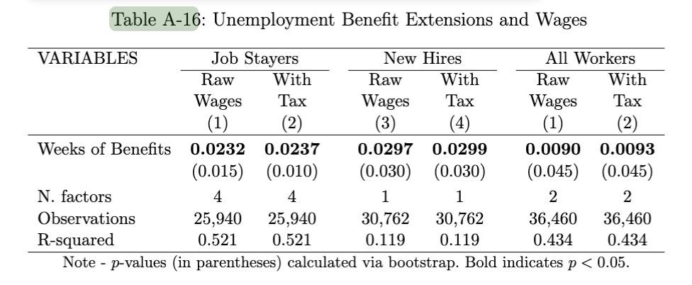{width=80%}

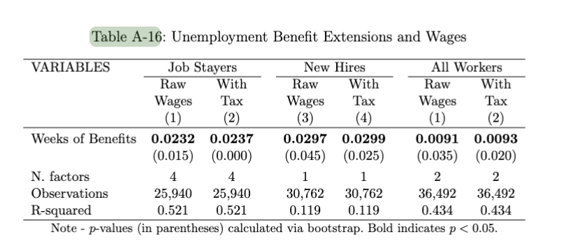{width=80%}

Table A-16
:::

**Finding:** The replicated table yields a different number of observations and different overall results compared to the paper.

The same issue also appears for Tables A-2, A-3, A-4, A-7, A-11, and A-12, which show discrepancies relative to the published tables.

::: {#tbl-a2 layout-ncol="2"}
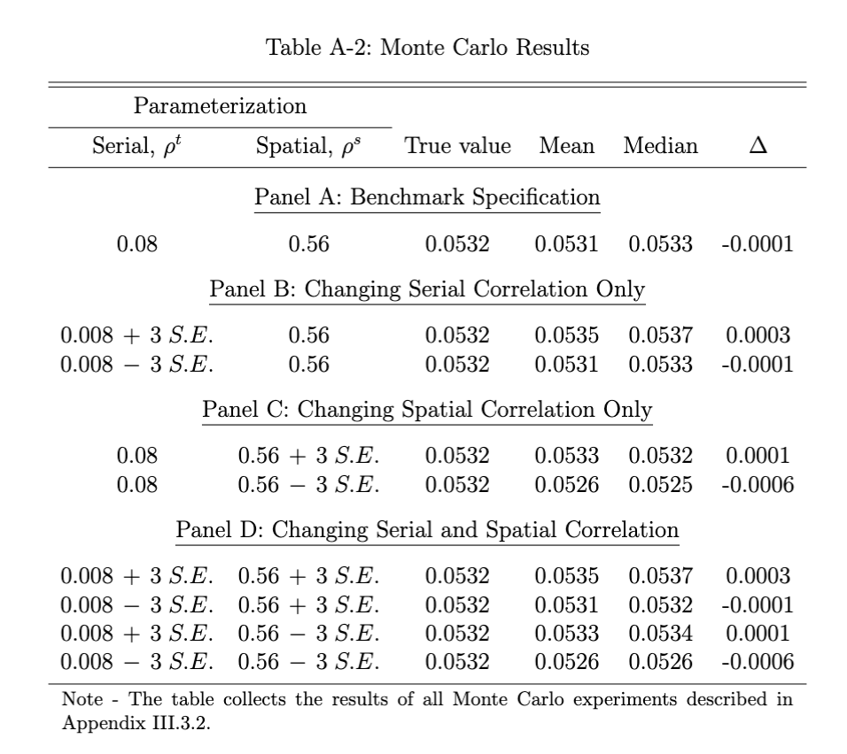{width=80%}

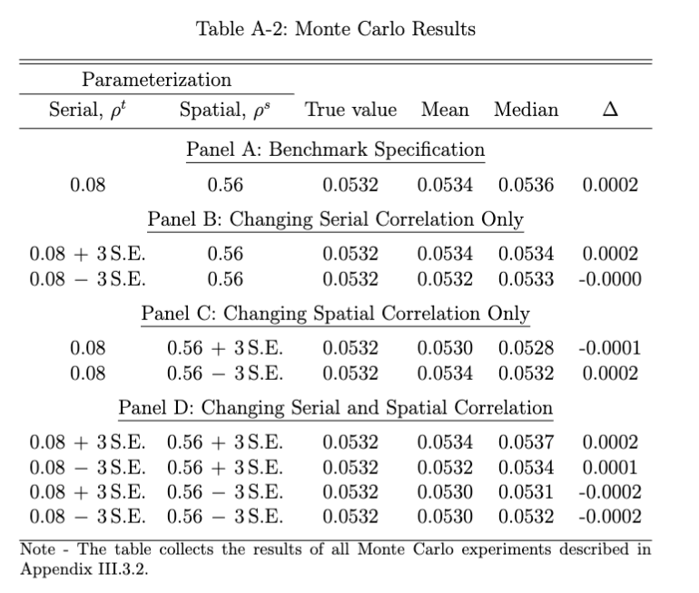{width=80%}

Table A-2
:::

::: {#tbl-a3 layout-ncol="2"}
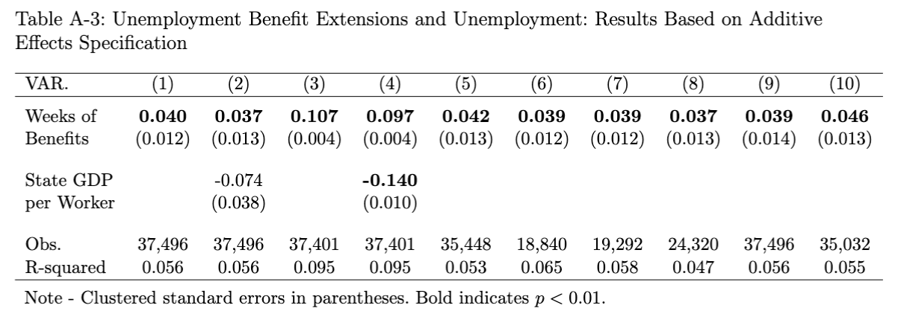{width=80%}

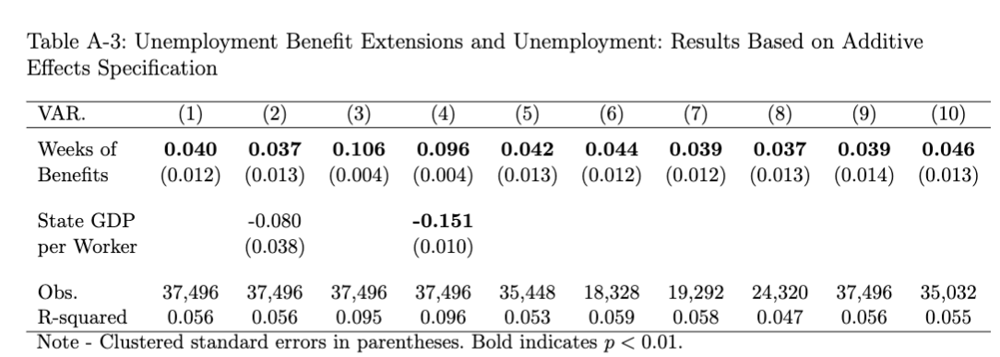{width=80%}

Table A-3
:::

::: {#tbl-a4 layout-ncol="2"}
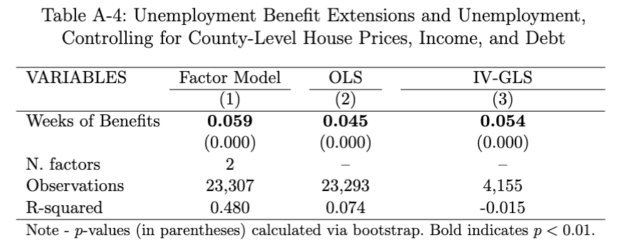{width=80%}

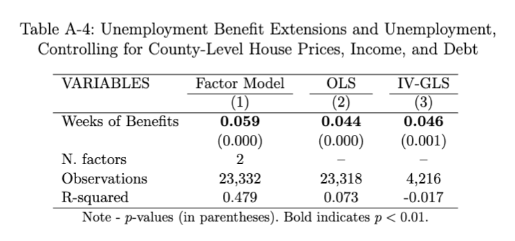{width=80%}

Table A-4
:::

::: {#tbl-a7 layout-ncol="2"}
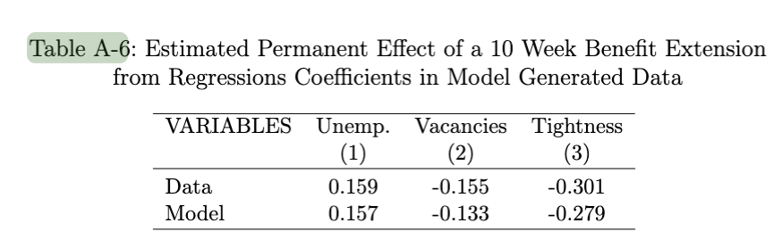{width=80%}

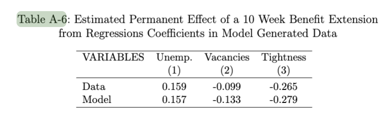{width=80%}

Table A-7
:::

::: {#tbl-a11 layout-ncol="2"}
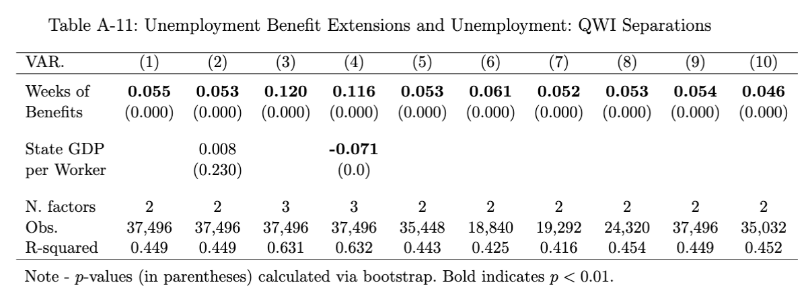{width=80%}

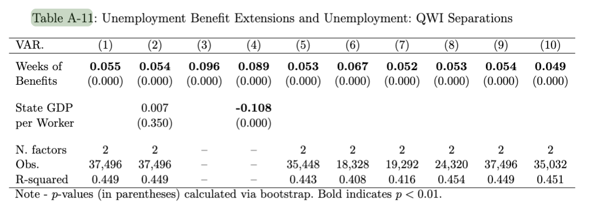{width=80%}

Table A-11
:::

::: {#tbl-a12 layout-ncol="2"}
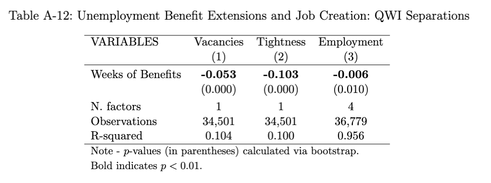{width=80%}

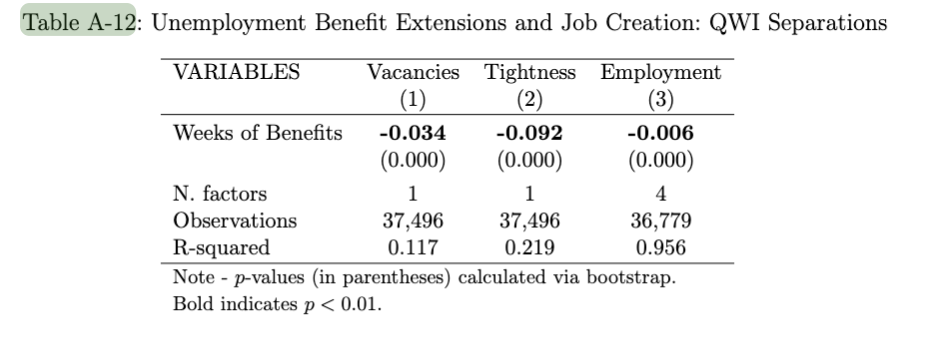{width=80%}

Table A-12
:::

## Other issues
- As mentioned before, please correct data citations.
- Please add information on controlled randomness.
- Make sure that when unzipping your replication package, the content is directly in `replication-package` folder. Now, it is double zipped under `JPEReplicationKitFinal`.


# Classification

> Full reproduction can include a small number of apparently insignificant changes in the numbers in the table. Full reproduction also applies when changes to the programs needed to be made, but were successfully implemented.
>
> Partial reproduction means that a significant number (>25%) of programs and/or numbers are different.
>
> Note that if some data is confidential and not available, then a partial reproduction applies. This should be noted in the Reasons.
>
> Note that when all data is confidential, it is unlikely that this exercise should have been attempted.
>
> Failure to reproduce: only a small number of programs ran successfully, or only a small number of numbers were successfully generated (<25%). This also applies when all data is restricted-access and none of the **main** tables/figures are run.

- [ ] full reproduction
- [ ] full reproduction with minor issues
- [x] partial reproduction (see above)
- [ ] not able to reproduce most or all of the results (reasons see above)

## Reason for incomplete reproducibility

- [ ] None.
- [x] `Discrepancy in output` (either figures or numbers in tables or text differ)
- [x] `Bugs in code` that were fixable by the replicator (but should be fixed in the final deposit)
- [ ] `Code missing`, in particular if it prevented the replicator from completing the reproducibility check
  - [ ] `Data preparation code missing` should be checked if the code missing seems to be data preparation code
- [ ] `Code not functional` is more severe than a simple bug: it prevented the replicator from completing the reproducibility check
- [ ] `Software not available to replicator` may happen for a variety of reasons, but in particular (a) when the software is commercial, and the replicator does not have access to a licensed copy, or (b) the software is open-source, but a specific version required to conduct the reproducibility check is not available.
- [ ] `Insufficient time available to replicator` is applicable when (a) running the code would take weeks or more (b) running the code might take less time if sufficient compute resources were to be brought to bear, but no such resources can be accessed in a timely fashion (c) the replication package is very complex, and following all (manual and scripted) steps would take too long.
- [x] `Data missing` is marked when data *should* be available, but was erroneously not provided, or is not accessible via the procedures described in the replication package
- [ ] `Data not available` is marked when data requires additional access steps, for instance purchase or application procedure. 
- [ ] `Missing README` is marked if there is no README to guide the replicator, or the README is not in compliance with JPE requirements