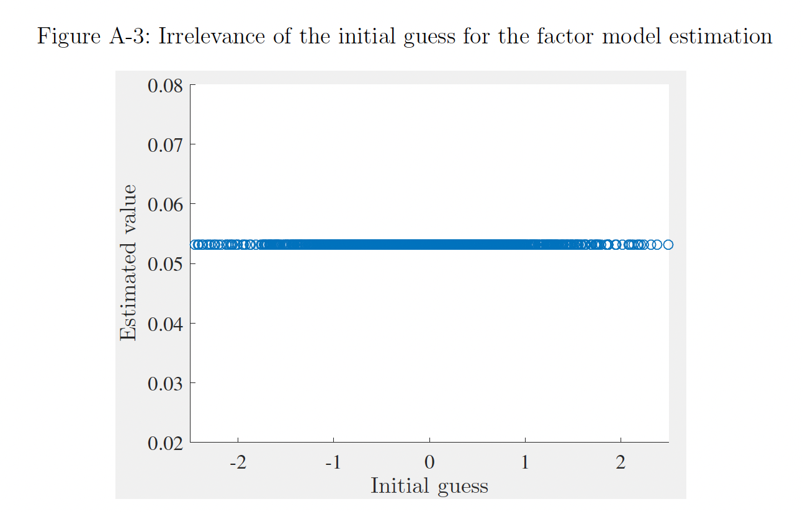
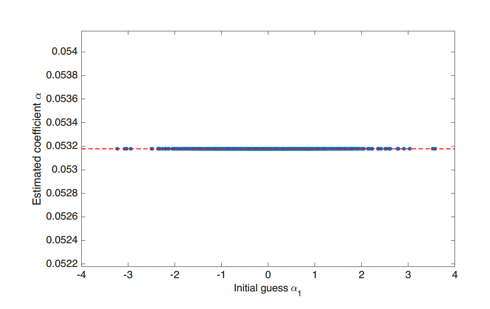
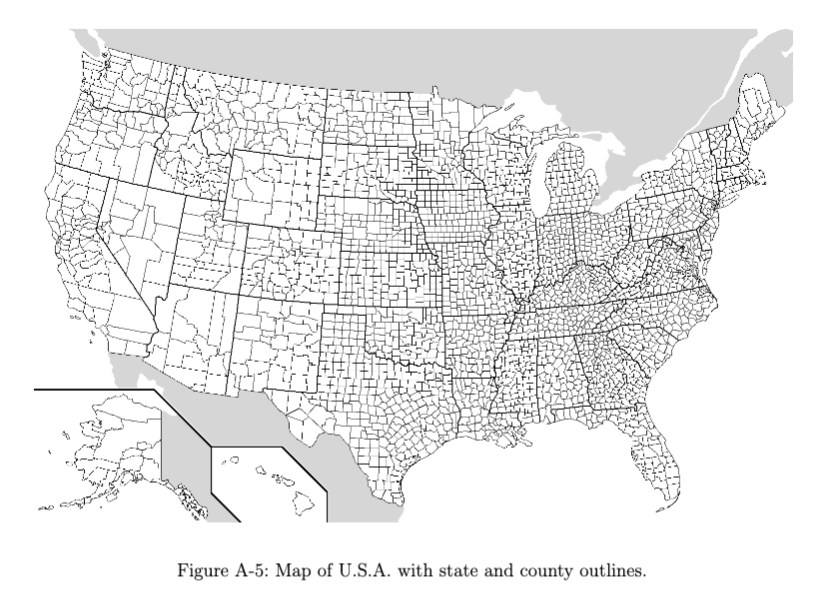
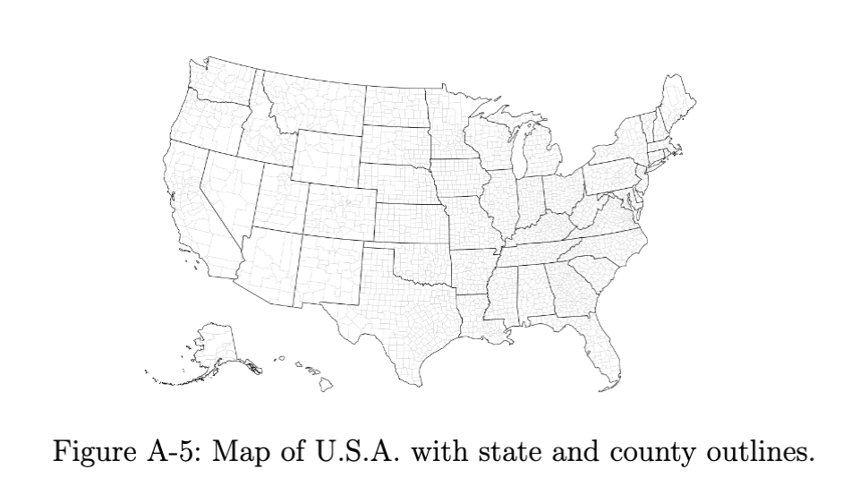
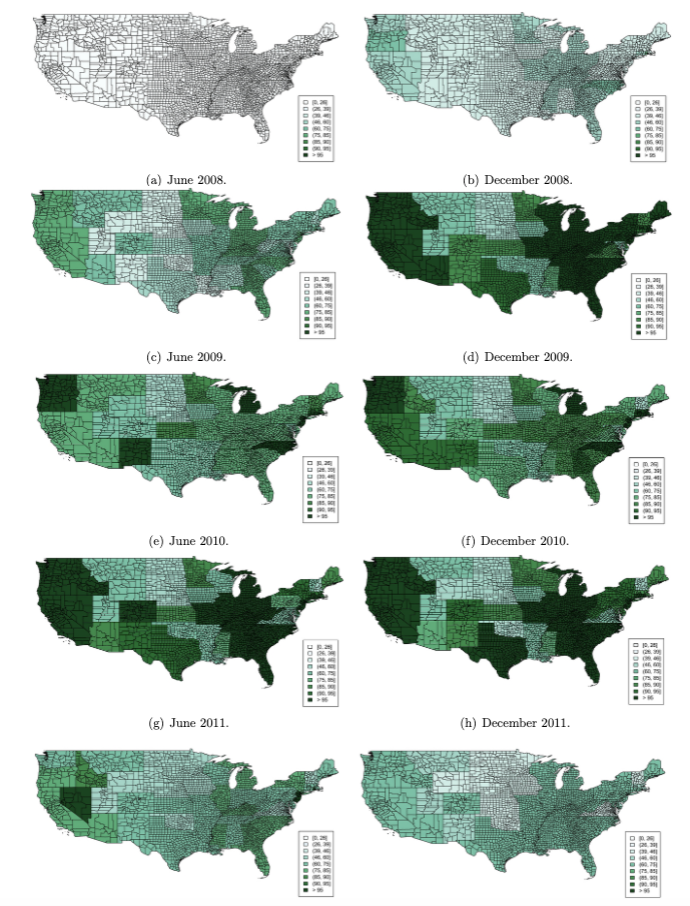
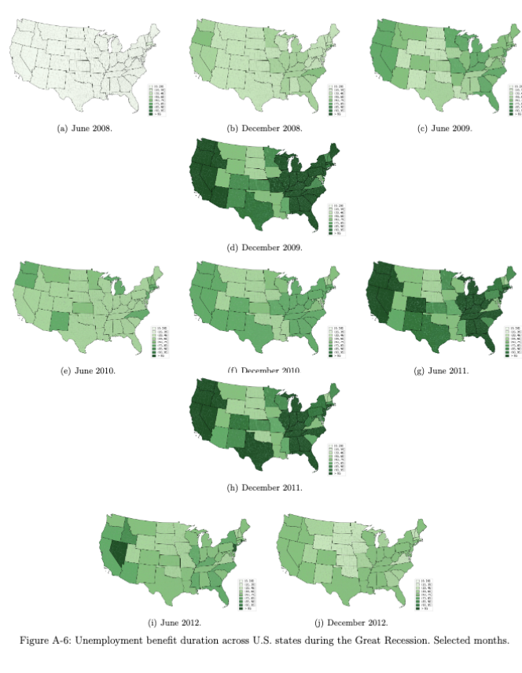
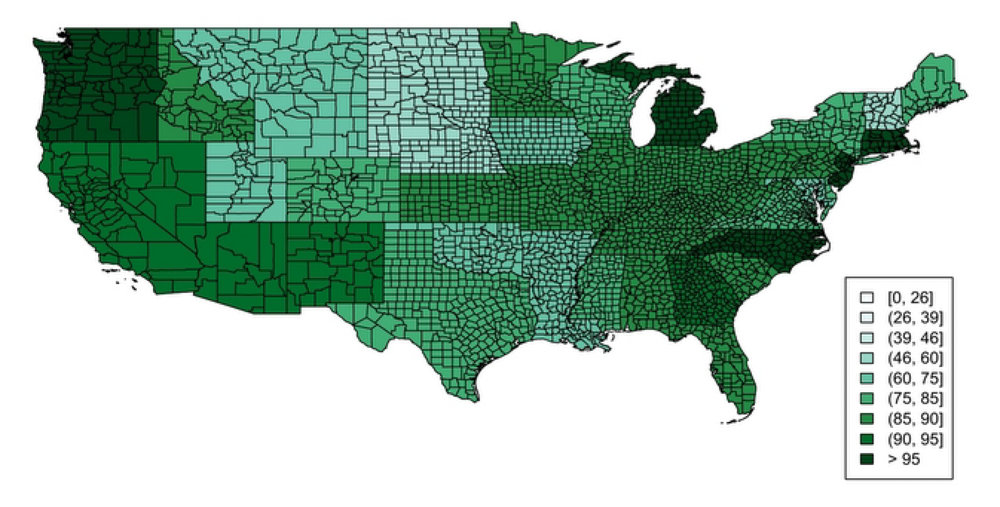
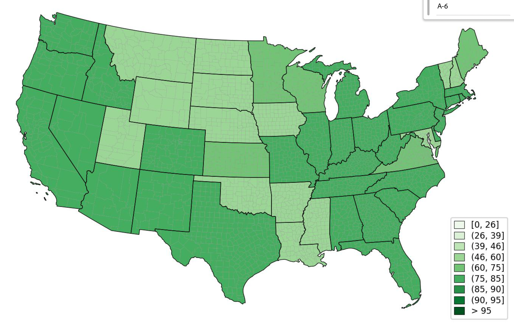

# Paper Identification

|  |   |
| ---  |  -------|
| ID  |   |
| Author  |   |
| Title  |   |
| Iteration |   |

# Summary

In assessing compliance with our [Data and Code Availability Policy](https://www.journals.uchicago.edu/journals/jpe/datapolicy), our reproducibility team has identified the following issues, which we ask you to address:

# General

- [x] Data Availability and Provenance Statements
  - [x] Statement about Rights - Part 1: Right to use the data (e.g. *did the authors lawfully obtain the data*)
  - [x] Statement about Rights - Part 2: Right to publish the data (e.g. *are human subjects involved and did permission been granted to publish their data?*)
  - [x] License for Data (optional, but recommended)
  - [x] Details on each Data Source
- [x] Dataset list
- [x] Computational requirements
  - [x] Software Requirements
  - [x] Controlled Randomness (as necessary)
  - [x] Memory, Runtime, and Storage Requirements
- [x] Description of programs/code
  - [x] License for Code (Optional, but recommended) 
- [x] List of tables and programs
- [x] References (Optional, but recommended) 

# High-level Description of Research Project

*This research project...*

- [x] uses observational data.
- [x] uses *confidential* observational data.
- [ ] uses data generated via experiment or trial by the authors (in field or lab).
  - [ ] For lab experiments: The code to implement the experimental protocol (z-Tree, o-Tree etc) is included in the package.
  - [ ] A PDF copy of IRB approval is contained in the package.
  - [ ] A PDF document outlining the design of the experiment, including information on the selection and eligibility of participants is included.
  - [ ] A PDF copy of the instructions given to participants in both original language and an English translation is included.
- [ ] uses data generated via survey by the authors (in field or online)
  - [ ] The programs used to administer the survey (e.g. qualtrics survey file) are included.
  - [ ] A PDF copy of IRB approval is contained in the package.
  - [ ] A PDF of the original questionaire(s) and information on the selection and eligibility of participants is included.
- [ ] is a simulation study: the data are generated by an algorithm.
- [ ] is a numerical illustration: no data are used but code is used to produce illustrative output (tables, figures)

# Data description

## Data Sources

| file/name | public | private | DOI/URL | Access described | cited readme | cited paper |
| ---- | --- | --- | --- | --- | --- | --- |
| BLS LAUS | yes | no | yes | yes | yes | yes |
| BLS JOLTS | yes | no | yes | yes | yes | yes |
| BLS QCEW | yes | no | yes | yes | yes | yes |
| Census LEHD QWI | yes | no | yes | yes | yes | yes |
| Census LODES | yes | no | yes | yes | yes | yes |
| BEA state GDP | yes | no | yes | yes | yes | yes |
| BEA CA25N industry employment | yes | no | yes | yes | yes | yes |
| FHFA HPI | yes | no | yes | yes | yes | yes |
| IRS SOI county income (via replication archive) | yes | no | yes | yes | yes | yes |
| NY Fed / Equifax county debt-to-income | yes | no | yes | yes | yes | yes |
| Saiz (2010) housing supply elasticity and WRLURI | yes | no | yes | yes | yes | yes |
| Census state tax revenue | yes | no | yes | yes | yes | yes |
| State business-policy indices | yes | no | yes | yes | yes | yes |
| USDA SNAP policy database | yes | no | yes | yes | yes | yes |
| Recovery.gov ARRA awards + geocorr crosswalk | yes | no | yes | yes | yes | yes |
| Census population estimates | yes | no | yes | yes | yes | yes |
| Shimer CPS separation series | yes | no | yes | yes | yes | yes |
| DOL / state UI benefit policy triggers | yes | no | yes | yes | yes | yes |
| County UI claims + UI tax receipts | yes | no | yes | yes | yes | yes |
| Census geography | yes | no | yes | yes | yes | yes |
| Conference Board HWOL vacancies (proprietary; synthetic stand-in provided) | no | yes | yes | yes | yes | yes |

# Requirements 

- [x] README is in TXT, MD, or PDF format
- [x] README is accessible at the root of the package (not inside a folder)
- [x] Title conforms to guidance (starts with "Data and Code for: Title of Paper" or "Code for: Title of Paper", is properly capitalized)
- [x] Authors (with affiliations) are listed in the same order as on the paper

## Stated Requirements

- [ ] No requirements specified
- [x] Software Requirements specified as follows:
  - **Stata/MP**, version 14 or later (the build and the `egen`-heavy steps assume MP; the
    seeded random draws use the mt64 generator, which is stable across Stata 14+). All
    required user-written commands install **automatically from SSC**: `code/config.do` —
    which every pipeline script sources — checks for and installs `regife` (interactive
    fixed effects), `reghdfe`, `ivreg2` (+ `ranktest`), `outreg2`, `binscatter`, `ftools`,
    `coefplot`, `tuples`, `hdfe`, and `mat2txt` on first run (an internet connection is
    needed once). No packages are bundled; `regife` is **not** redistributed — it loads
    from SSC like the rest. `config.do` also sets `scheme s2color` so regenerated figures
    match the published styling (Stata 18+ defaults to the newer `stcolor` scheme, which
    looks different).
  - **MATLAB** (developed and tested on R2025b) for the factor model, block bootstrap, and
    the structural model. Point estimates are deterministic and reproduce across MATLAB
    versions; see "Controlled Randomness" for a version caveat affecting bootstrap
    p-values/standard errors only.
  - **Python 3** for `code/tex/make_tables.py` (standard library only). The two map figures
    additionally need `geopandas` + `matplotlib` (any recent version; the driver skips the
    maps with a warning if geopandas is absent).
  - A **TeX** distribution (pdflatex + bibtex) to compile the paper.
- [x] Computational Requirements specified as follows:
  - Storage: ≈10 GB free disk
  - Memory: 16 GB is comfortable for every step (the reproducibility check ran on a 64 GB machine; nothing approaches that bound)
- [x] Time Requirements specified as follows:
  - Runtime: ≈10–15 hours sequentially on a modern multi-core machine, of which: the from-raw input rebuild ≈1.5 h; the 31 factor-model front-ends with 200-rep bootstraps ≈5–15 min each; the 200-pairing Scrambles runs ≈1–2 h; the Monte Carlo and the structural model most of the remainder. The Stata build itself takes minutes.

- [x] Requirements are complete.

# Analyzing Data and Code Files











## Code description



- [x] The replication package contains a "main" or "master" file(s) which calls all other auxiliary programs.

### Summary of output-producing code
The package contains a master code in [replication-package/replication-package/code/RunBuild.do](replication-package/replication-package/code/RunBuild.do#L37-L120) that runs the raw-data build steps and the processed-data construction stages. The paper tables are assembled by [replication-package/replication-package/code/tex/make_tables.py](replication-package/replication-package/code/tex/make_tables.py#L384-L1138), which reads CSV outputs generated by the Stata and Matlab analysis scripts and writes .tex fragments into the output/tables directory. The main figures are produced directly by [replication-package/replication-package/code/analysis/Binscatter_Figures.do](replication-package/replication-package/code/analysis/Binscatter_Figures.do#L60-L96), [replication-package/replication-package/code/analysis/MO_Tightness_Figures.do](replication-package/replication-package/code/analysis/MO_Tightness_Figures.do#L70-L120), [replication-package/replication-package/code/analysis/Make_CountyMap.py](replication-package/replication-package/code/analysis/Make_CountyMap.py#L3-L55), and [replication-package/replication-package/code/analysis/Make_BenefitMaps.py](replication-package/replication-package/code/analysis/Make_BenefitMaps.py#L3-L77). Per the README's exhibit classification, Binscatter_Figures.do (Figure 1), Make_CountyMap.py (Figure A-5), and Make_BenefitMaps.py (Figure A-6) reproduce exactly, while MO_Tightness_Figures.do (Figures A-1 and A-2, and the vacancy/tightness columns of Table A-1) depends on the proprietary Conference Board HWOL vacancy series, which is excluded from the archive under the authors' data-use agreement; as shipped it runs on a public-data synthetic stand-in and so produces demonstrative, not published, output. A small set of inline policy numbers is derived in [replication-package/replication-package/code/analysis/Derived_Policy_Calcs.do](replication-package/replication-package/code/analysis/Derived_Policy_Calcs.do#L1-L145), which reproduces exactly except that its tightness-scenario row re-uses the published HWOL-based coefficient (0.101) as a stated constant rather than re-estimating it.

### Data Preparation Code
| Program | Dataset or analysis file created | Reproduced? |
| --- | --- | --- |
| [replication-package/replication-package/code/RunBuild.do](replication-package/replication-package/code/RunBuild.do#L37-L120) | Main orchestrator for the full raw-data rebuild and the processed-data build. | Yes |
| [replication-package/replication-package/code/build/MakeDataSetsMainPaper_v5_newvac.do](replication-package/replication-package/code/build/MakeDataSetsMainPaper_v5_newvac.do#L1-L40) | Builds the main analysis panel used in the paper regressions. | Yes |
| [replication-package/replication-package/code/build/MakeDataControls.do](replication-package/replication-package/code/build/MakeDataControls.do#L1-L80) | Builds the control-variable panel used by the analysis scripts. | Yes |
| [replication-package/replication-package/code/analysis/Derived_Policy_Calcs.do](replication-package/replication-package/code/analysis/Derived_Policy_Calcs.do#L1-L145) | Writes the derived policy-scenario CSV that underlies the paper's inline policy numbers. | Yes |

### Tables and Figures
| Output in paper | Program and line number(s) | Reproduced? |
| --- | --- | --- |
| Table 1 / tab:Benefits_on_unemp | [replication-package/replication-package/code/tex/make_tables.py](replication-package/replication-package/code/tex/make_tables.py#L384-L484) | Yes |
| Table 2 / tab:Forward_Spec | [replication-package/replication-package/code/tex/make_tables.py](replication-package/replication-package/code/tex/make_tables.py#L661-L702) and [replication-package/replication-package/code/matlab/ProcessQDK.m](replication-package/replication-package/code/matlab/ProcessQDK.m#L107-L125) | Yes |
| Table 3 / tab:Benefits_on_JobCreation | [replication-package/replication-package/code/tex/make_tables.py](replication-package/replication-package/code/tex/make_tables.py#L997-L1030) | Partial — col 3 (Employment) only; cols 1-2 (Vacancies, Tightness) require licensed HWOL data and are demonstrative as shipped |
| Table 4 / tab:Benefits_on_Wages | [replication-package/replication-package/code/tex/make_tables.py](replication-package/replication-package/code/tex/make_tables.py#L737-L827) | Yes |
| Figure 1(a) and Figure 1(b) / fig:binscatter_du and fig:binscatter_qdu | [replication-package/replication-package/code/analysis/Binscatter_Figures.do](replication-package/replication-package/code/analysis/Binscatter_Figures.do#L60-L96) | Yes |
| Figure A-1 / fig:MO_vacPuD | [replication-package/replication-package/code/analysis/MO_Tightness_Figures.do](replication-package/replication-package/code/analysis/MO_Tightness_Figures.do#L70-L120) | No — requires licensed HWOL state vacancy data; demonstrative as shipped |
| Figure A-2 / fig:Tightness_MO_Borders | [replication-package/replication-package/code/analysis/MO_Tightness_Figures.do](replication-package/replication-package/code/analysis/MO_Tightness_Figures.do#L70-L120) | No — requires licensed HWOL state vacancy data; demonstrative as shipped |
| Table A-1 / tab:MO_V_U | [replication-package/replication-package/code/tex/make_tables.py](replication-package/replication-package/code/tex/make_tables.py#L1070-L1099) and [replication-package/replication-package/code/analysis/MO_Tightness_Figures.do](replication-package/replication-package/code/analysis/MO_Tightness_Figures.do#L104-L120) | Partial — Unemployment column only; Vacancy and Tightness columns require licensed HWOL data |
| Figure A-3 / fig:initial-guess | [replication-package/replication-package/code/matlab/Fig_InitialGuess.m](replication-package/replication-package/code/matlab/Fig_InitialGuess.m#L1-L20) | Yes |
| Table A-2 / tab:Monte-Carlo-Results | [replication-package/replication-package/code/tex/make_tables.py](replication-package/replication-package/code/tex/make_tables.py#L1138-L1160) and [replication-package/replication-package/code/matlab/RunMonteCarlo.m](replication-package/replication-package/code/matlab/RunMonteCarlo.m#L1-L30) | Yes |
| Table A-3 / tab:Benefits_on_unemp_OLS | [replication-package/replication-package/code/tex/make_tables.py](replication-package/replication-package/code/tex/make_tables.py#L293-L381) | Yes |
| Table A-4 / tab:Endog_Vars | [replication-package/replication-package/code/tex/make_tables.py](replication-package/replication-package/code/tex/make_tables.py#L878-L919) and [replication-package/replication-package/code/analysis/Endog_Vars.do](replication-package/replication-package/code/analysis/Endog_Vars.do#L34-L84) | Yes |
| Figure A-4 / fig:endogeneity_test_unemp | [replication-package/replication-package/code/model/RunModel.m](replication-package/replication-package/code/model/RunModel.m#L1-L96) and [replication-package/replication-package/code/model/Fig_StateU.m](replication-package/replication-package/code/model/Fig_StateU.m#L1-L81) | Yes |
| Table A-7 / tab:Mobility_LODES | [replication-package/replication-package/code/tex/make_tables.py](replication-package/replication-package/code/tex/make_tables.py#L923-L952) and [replication-package/replication-package/code/analysis/Mobility_LODES.do](replication-package/replication-package/code/analysis/Mobility_LODES.do#L29-L172) | Yes |
| / tab:Imputed_Results | [replication-package/replication-package/code/tex/make_tables.py](replication-package/replication-package/code/tex/make_tables.py#L956-L993) and [replication-package/replication-package/code/analysis/Imputed_Results.do](replication-package/replication-package/code/analysis/Imputed_Results.do#L28-L166) | No — all columns run on the vacancy file (`${vacfile}`); requires licensed HWOL data. The generated `.tex` is a comparison file only; the published table is typeset directly in the paper source |
| Table A-9 / app_tab:A-1 | [replication-package/replication-package/code/tex/make_tables.py](replication-package/replication-package/code/tex/make_tables.py#L831-L876) and [replication-package/replication-package/code/analysis/TableA2.do](replication-package/replication-package/code/analysis/TableA2.do#L110-L168) | Yes |
| Table A-11 / tab:Benefits_on_unemp_beg | [replication-package/replication-package/code/tex/make_tables.py](replication-package/replication-package/code/tex/make_tables.py#L488-L605) | Yes |
| Table A-13 / tab:Benefits_on_unemp_SNAP_Mortgage | [replication-package/replication-package/code/tex/make_tables.py](replication-package/replication-package/code/tex/make_tables.py#L167-L197) | Yes |
| Table A-14 / tab:Benefits_on_unemp_stimulus_taxes | [replication-package/replication-package/code/tex/make_tables.py](replication-package/replication-package/code/tex/make_tables.py#L239-L290) | Yes |
| Table A-15 / tab:Benefits_on_unemp_other_policies | [replication-package/replication-package/code/tex/make_tables.py](replication-package/replication-package/code/tex/make_tables.py#L200-L236) | Yes |
| Figure A-5 / fig:Counties_Map | [replication-package/replication-package/code/analysis/Make_CountyMap.py](replication-package/replication-package/code/analysis/Make_CountyMap.py#L3-L55) | Yes |
| Figure A-6 and Figure 6(a-j) / fig:Benefit_Maps and fig:Benefit_Maps_42 through fig:Benefit_Maps_96 | [replication-package/replication-package/code/analysis/Make_BenefitMaps.py](replication-package/replication-package/code/analysis/Make_BenefitMaps.py#L3-L77) | Yes |
| Table A-16 / tab:app_Benefits_on_Wages | [replication-package/replication-package/code/tex/make_tables.py](replication-package/replication-package/code/tex/make_tables.py#L737-L827) | Yes |

### In-Text Numbers
"Narrative" means the number is an institutional fact, a cited value, or a hand calculation stated in the paper text; no program produces it, and none is expected to. Everything else was checked against the authors' shipped output in `output/`.

| In-text numbers | Program | Line Number | Reproduced? |
| --- | --- | --- | --- |
| 16,000 (online job boards covered by HWOL) | Narrative — Conference Board HWOL documentation, no program | n/a | n/a — provider documentation, not computed. HWOL is confidential and not shipped |
| 93% (HWOL vacancies matched to a county) | Narrative — Conference Board HWOL documentation, no program | n/a | n/a — provider documentation, not computed |
| 5% (HWOL vacancies coded "statewide") | Narrative — Conference Board HWOL documentation, no program | n/a | n/a — provider documentation, not computed |
| 2% (HWOL vacancies coded "nationwide") | Narrative — Conference Board HWOL documentation, no program | n/a | n/a — provider documentation, not computed |
| 1,172 (border county pairs) | [replication-package/replication-package/code/matlab/Factor_FrontEnd_Bench.m](replication-package/replication-package/code/matlab/Factor_FrontEnd_Bench.m#L18) | L18 | Yes — `output/factor_results/Bench_qd1_unemp_Nobs.csv` = 37,496 = 1,172 x 32 quarters |
| 1,132 (pairs with different benefits in at least one quarter) | No program — recomputed by the replicator from `data/processed/UIMacro_DataControls.dta` (`diff_logmeanwks`, 2008-2012) | n/a | **No — the data give 1,142, not 1,132** (10 pairs more). Stable across tolerances from 1e-9 to 0.02, so it is not a rounding artifact |
| 14 (median quarters with different durations) | No program — recomputed by the replicator from `data/processed/UIMacro_DataControls.dta` | n/a | Yes — median = 14 quarters (2008-2012) |
| 0 to 18 (range of quarters with different durations) | No program — recomputed by the replicator from `data/processed/UIMacro_DataControls.dta` | n/a | Yes — range = 0 to 18 quarters |
| 1,113 (counties below 15% of state employment) | [replication-package/replication-package/code/analysis/Bias_Sim_Shares.do](replication-package/replication-package/code/analysis/Bias_Sim_Shares.do#L29) | L29 | **No — the script returns 1,108** (`output/factor_results/Bias_Sim_Shares.csv`). The companion 2% average share does reproduce (2.0%) |
| 59 (counties at or above 15% of state employment) | [replication-package/replication-package/code/analysis/Bias_Sim_Shares.do](replication-package/replication-package/code/analysis/Bias_Sim_Shares.do#L34) | L34 | **No — the script returns 64** (`output/factor_results/Bias_Sim_Shares.csv`). The companion 35% average share comes out at 34.3%. Note 1,108 + 64 = 1,172, so the split moves but the total is right |
| 282 / 9,024 (single-county-LMA claims sample) | [replication-package/replication-package/code/exporters/OutputDataSetsUIMacro_JFR.do](replication-package/replication-package/code/exporters/OutputDataSetsUIMacro_JFR.do#L21-L26) | L21-L26 | Yes — `output/factor_results/JFR_jfr_unemp_Nobs.csv` = 9,024 = 282 x 32 |
| 26 to 99 (weeks, maximum benefit duration) | Narrative — UI programme description, no program | n/a | n/a — policy fact |
| 13 or 20 (extra weeks under EB) | Narrative — UI programme description, no program | n/a | n/a — policy fact |
| 4 (EUC08 tiers) | Narrative — UI programme description, no program | n/a | n/a — policy fact |
| 10.7% (sequester cut to EB/EUC08 spending) | Narrative — 2013 budget sequestration, no program | n/a | n/a — policy fact; the paper states it but does not use it |
| 16 (weeks cut in Missouri, April 2011) | Narrative — cited from Johnston and Mas (2015), no program | n/a | n/a — cited value; it is the event date marked in Figures A-1/A-2 |
| 13 (initial extra weeks under EUC08; also the placebo extension) | [replication-package/replication-package/code/build/Make_PlaceboWeeksData.do](replication-package/replication-package/code/build/Make_PlaceboWeeksData.do#L9) | L9, L43 | Yes as used — the placebo build sets 26 + 13 = 39 weeks exactly as the text describes |
| 3.02 and 2.15 (pp lower unemployment in 2010/2011) | [replication-package/replication-package/code/analysis/Derived_Policy_Calcs.do](replication-package/replication-package/code/analysis/Derived_Policy_Calcs.do#L109-L113) | L109-L113 | Yes — 3.0186 and 2.1545 (`output/factor_results/Derived_Policy_Calcs.csv`) |
| 5% to 9.6% (long-run unemployment, permanent 26 to 99) | [replication-package/replication-package/code/analysis/Derived_Policy_Calcs.do](replication-package/replication-package/code/analysis/Derived_Policy_Calcs.do#L48-L55) | L48, L53-L55 | Yes — 9.6023 (`Derived_Policy_Calcs.csv`); the 5% base is an assumption set at L48 |
| 95% to 90.4% (long-run employment analogue) | [replication-package/replication-package/code/analysis/Derived_Policy_Calcs.do](replication-package/replication-package/code/analysis/Derived_Policy_Calcs.do#L56-L57) | L56-L57 | Yes — 90.3977 (`Derived_Policy_Calcs.csv`) |
| 10% (average quarterly JOLTS separation rate) | [replication-package/replication-package/code/analysis/Derived_Policy_Calcs.do](replication-package/replication-package/code/analysis/Derived_Policy_Calcs.do#L47) | L47 | Yes — hard-coded as 0.10; the replicator checked it against the shipped `data/raw/jolts2013.dta`, whose mean quarterly separation rate is 0.1048 |
| 0.4 to 0.5 (consensus matching-function elasticity) | Narrative — cited from Brugemann (2008) and Petrongolo and Pissarides (2001), no program | n/a | n/a — cited range; the midpoint 0.45 is used at [Derived_Policy_Calcs.do L61](replication-package/replication-package/code/analysis/Derived_Policy_Calcs.do#L61) |
| 0.0528 (unemployment change via the tightness margin) | [replication-package/replication-package/code/analysis/Derived_Policy_Calcs.do](replication-package/replication-package/code/analysis/Derived_Policy_Calcs.do#L60-L62) | L60-L62 | Yes — 0.05277. Caveat: the tightness coefficient 0.101 is entered at L60 as a published constant, because re-estimating it needs the confidential HWOL data |
| 73 (weeks of extension, 99 minus 26) | Narrative — arithmetic in the text, no program | n/a | n/a — arithmetic |
| 7.3 to 14.6 (implied extra weeks of unemployment duration) | Narrative — 73 x 0.1 and 73 x 0.2, arithmetic in the text | n/a | n/a — arithmetic on elasticities taken from the micro literature review |
| 5/27 (zeta, non-participant search margin) | [replication-package/replication-package/code/analysis/Impute_Input.do](replication-package/replication-package/code/analysis/Impute_Input.do#L104) and [impute_border_search.m](replication-package/replication-package/code/matlab/impute_border_search.m#L60) | Impute_Input.do L104; impute_border_search.m L60 | Yes as used — calibrated constant from Hall (2013), coded as 5/27 in both places |
| 0.78% (wage gap, 70 vs 50 weeks of benefits) | [replication-package/replication-package/code/matlab/Factor_FrontEnd_QWIWStayers.m](replication-package/replication-package/code/matlab/Factor_FrontEnd_QWIWStayers.m) via [make_tables.py](replication-package/replication-package/code/tex/make_tables.py#L737-L827) | make_tables.py L737-L827 | Yes — the input coefficient is Table A-16 Column (1), which reproduces at 0.0232; exp(0.0232 x (ln 70 - ln 50)) = 1.0078, i.e. 0.78%. The final step is arithmetic in the footnote, not in code |
| 0.101 (tightness response to benefit duration, used in the 0.0528 calculation) | [replication-package/replication-package/code/analysis/Derived_Policy_Calcs.do](replication-package/replication-package/code/analysis/Derived_Policy_Calcs.do#L60) — published source is Table 3 Column (2), [make_tables.py](replication-package/replication-package/code/tex/make_tables.py#L997-L1030) | L60 | **No — cannot be checked.** Table 3 Column (2) needs the confidential HWOL vacancy data, so the coefficient is typed into the script as a constant rather than re-estimated. On the shipped synthetic stand-in the same column comes out at -0.089, which is demonstrative only |
| 0.951 and 0.316 (Hall endogeneity test, LAUS unemployment rate on state and adjacent county) | [replication-package/replication-package/code/analysis/TableA2.do](replication-package/replication-package/code/analysis/TableA2.do#L110-L168) | L110-L168 | Yes — 0.9507 and 0.3161 (`output/factor_results/Hall_Inline.csv`, row `laus_rate`) |
| 1.121 and 0.415 (same test on continuing claims divided by population) | [replication-package/replication-package/code/analysis/TableA2.do](replication-package/replication-package/code/analysis/TableA2.do#L113-L160) | L113-L160 | **No — the script returns 0.891 and 0.312** (`output/factor_results/Hall_Inline.csv`, row `claims_pop`). Not a data-access problem: the claims file ships (README dataset list, row 19). The script header at L114-L121 states the original program was lost and that this is a reconstruction using an all-county state aggregate, so the published magnitudes cannot be recovered until the authors supply the original construction. The paper's conclusion — claims show the same large-state pattern as LAUS — still holds |
| 30 (miles, median distance between population centres) | [replication-package/replication-package/code/exporters/OutputDataSetsUIMacro_Dist30.do](replication-package/replication-package/code/exporters/OutputDataSetsUIMacro_Dist30.do#L24) | L24 | Yes — the replicator computed the median of `dist` in `UIMacro_DataControls.dta` at 29.62 miles, which rounds to the stated 30 |
| 10,000 (minimum core population of a CBSA) | Narrative — OMB (2010) CBSA definition, no program | n/a | n/a — definitional |

Summary: the table lists 32 numbers. 13 are narrative (policy facts, cited values, or arithmetic stated in the text) and need no code. Of the 19 that are data- or code-based, 14 reproduce, 4 do not, and 1 cannot be checked at all.

The four misses are **1,132** (comes out at 1,142), **1,113** (comes out at 1,108), **59** (comes out at 64), and the Hall claims pair **1.121 / 0.415** (comes out at 0.891 / 0.312). The one number that cannot be checked is the tightness coefficient **0.101** behind the 0.0528 calculation. All four misses can be re-derived from the shipped data with [verify/recompute_intext.do](replication-package/replication-package/verify/recompute_intext.do), which the replicator ran in Stata/MP 19.5 with no errors; a Python equivalent, [verify/recompute_intext.py](replication-package/replication-package/verify/recompute_intext.py), returns the same figures. The Stata run matches the authors' own shipped `Hall_Inline.csv` to seven decimals (0.8911967 and 0.3116272, N=9,344), confirming the mismatch is in the reconstruction itself and not in the replicator's re-implementation.

Only the tightness coefficient is caused by the withheld HWOL data. The other four are not, and should not be reported as licensing casualties:

- **1,132**: output from `diff_logmeanwks`, built from `benefit_weeks.dta`, which ships and which the README states is identical to the authors' own ICPSR deposit. The gap is 10 pairs that differ in only a few quarters out of 20; 23 pairs differ in 3 quarters or fewer, so a small shift in the benefit-weeks series moves the count. It is not due to rounding.
- **1,113 / 59**: output from `emp_share`, defined at [MakeDataSetsMainPaper_v5_newvac.do L164-L166](replication-package/replication-package/code/build/MakeDataSetsMainPaper_v5_newvac.do#L164-L166) as `emp_laus/emp_state_u` in 2012q4 — LAUS county employment over BLS state employment, both shipped and both vintage-stamped. The gap is at the 0.15 cutoff and runs upward: the archived vintage places five *more* pairs at or above 0.15 than the published text did. Recovering 1,113 / 59 requires the five lowest pairs now above the line — 0.1502, 0.1507, 0.1607, 0.1607 and 0.1615 — to fall below it. Two are within 0.001 of the cutoff, but three sit about 0.011 above it, so this is not pure rounding: the employment ratio for those three would need to be roughly 7% lower in the authors' vintage.
- **1.121 / 0.415**: the continuing-claims file ships (README dataset list, row 19). The authors' own script header records that the original producing program was lost and that the shipped version is a reconstruction using an all-county state aggregate.

The synthetic vacancy stand-in is merged into the panel at [MakeDataSetsMainPaper_v5_newvac.do L133](replication-package/replication-package/code/build/MakeDataSetsMainPaper_v5_newvac.do#L133), but that merge only adds vacancy columns and drops no rows, so it cannot move any of these four counts. All four are deterministic given the shipped inputs: re-running the package will reproduce 1,142 / 1,108 / 64 / 0.891 / 0.312 every time. Note also that 1,108 + 64 = 1,172 and 1,142 + 30 = 1,172, so the pair sample itself is intact; only the underlying values shifted. The likeliest explanation for the first three is that the published text was written against an earlier LAUS and benefit-weeks vintage than the one archived here. The authors should either update the text to the archived vintage or state which vintage the published numbers came from.

## Computing Environment of the Replicator
- Macbook Air 2020 M1, 8GB RAM
- Stata/MP 19.5
- Matlab R2026a
- Python 3.11.5
- pdfTeX 3.141592653-2.6-1.40.27

# Replication

The code and data were accessed via the provided replication package. The code ran smoothly without any modifications needed.

## Findings {#sec-findings}

All tables and figures were reproduced except: Table 3 columns 1–2 (Vacancies, Tightness), Table A-1 (Vacancy and Tightness columns), Table A-6 (Data-row Vacancy/Tightness cells), Table A-8 (all columns), Table A-12 columns 1–2, and Figures A-1 and A-2, as stated by the authors. Styling issues persist for the descriptive figures A-3, A-5, A-6, as acknowledged by the authors.

## Data Preparation Code

Programs ran without errors.

## Tables and Figures

### Figures

**Figure A-3 (`initial_guess.pdf`)**

::: {#fig-a3 layout-ncol="2"}
{width=80%}

{width=80%}

Figure A-3
:::

**Finding:** The reproduced version differs a lot in style but also in naming of the axes. 

::: {#fig-a5 layout-ncol="2"}
{width=80%}

{width=80%}

Figure A-5
:::

**Finding:** Reproduced, but features a completely different style and look compared to the published paper.

::: {#fig-a6 layout-ncol="2"}
{width=80%}

{width=80%}

Figure A-6
:::

**Finding:** Content does not match and features a completely different style and look compared to the published paper. Please look at the panel (f) below:

::: {#fig-a6 layout-ncol="2"}
{width=80%}

{width=80%}

Figure A-6 (f)
:::

## Other issues

- Three in-text numbers couldn't be reproduced - please check the issue in the previous section.

# Classification

> Full reproduction can include a small number of apparently insignificant changes in the numbers in the table. Full reproduction also applies when changes to the programs needed to be made, but were successfully implemented.
>
> Partial reproduction means that a significant number (>25%) of programs and/or numbers are different.
>
> Note that if some data is confidential and not available, then a partial reproduction applies. This should be noted in the Reasons.
>
> Note that when all data is confidential, it is unlikely that this exercise should have been attempted.
>
> Failure to reproduce: only a small number of programs ran successfully, or only a small number of numbers were successfully generated (<25%). This also applies when all data is restricted-access and none of the **main** tables/figures are run.

- [ ] full reproduction
- [ ] full reproduction with minor issues
- [x] partial reproduction (see above)
- [ ] not able to reproduce most or all of the results (reasons see above)

## Reason for incomplete reproducibility

- [ ] None.
- [x] `Discrepancy in output` (either figures or numbers in tables or text differ)
- [ ] `Bugs in code` that were fixable by the replicator (but should be fixed in the final deposit)
- [ ] `Code missing`, in particular if it prevented the replicator from completing the reproducibility check
  - [ ] `Data preparation code missing` should be checked if the code missing seems to be data preparation code
- [ ] `Code not functional` is more severe than a simple bug: it prevented the replicator from completing the reproducibility check
- [ ] `Software not available to replicator` may happen for a variety of reasons, but in particular (a) when the software is commercial, and the replicator does not have access to a licensed copy, or (b) the software is open-source, but a specific version required to conduct the reproducibility check is not available.
- [ ] `Insufficient time available to replicator` is applicable when (a) running the code would take weeks or more (b) running the code might take less time if sufficient compute resources were to be brought to bear, but no such resources can be accessed in a timely fashion (c) the replication package is very complex, and following all (manual and scripted) steps would take too long.
- [ ] `Data missing` is marked when data *should* be available, but was erroneously not provided, or is not accessible via the procedures described in the replication package
- [x] `Data not available` is marked when data requires additional access steps, for instance purchase or application procedure. 
- [ ] `Missing README` is marked if there is no README to guide the replicator, or the README is not in compliance with JPE requirements